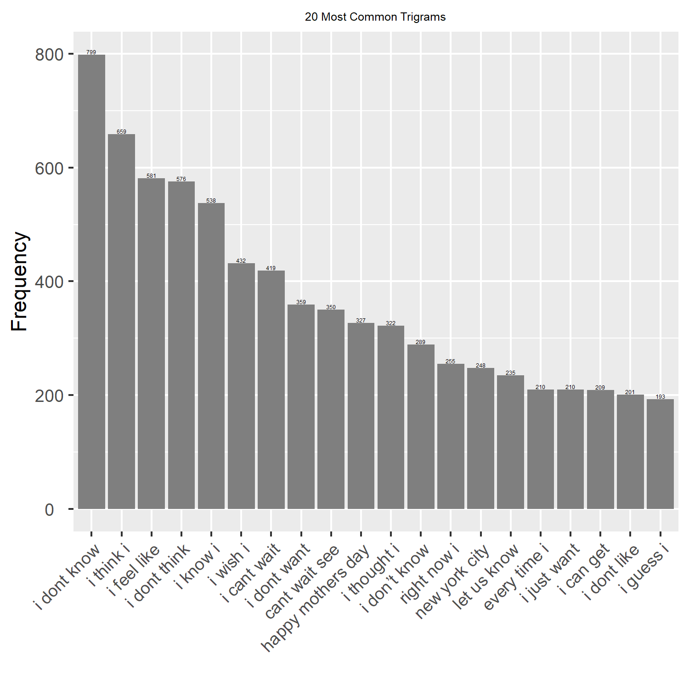

Text Prediction Algorithm - Project Proposal
========================================================
author: Aquinas
date: 04-June-2020
autosize: true

Project Overview
========================================================

- Project Goal: to create a text-predictive algorithm model which can be used as the basis for a future app
- We are considering a partnership with SwiftKey, and they provided us a corpus from twitter, blogs, and news articles
- We used the English version of the corpus, removed white space, punctuation, and profanity, and then developed N-grams for prediction
- In this project we will deploy a simple app with a first-order level algorithm to decide whether to continue along this path

Algorithm Overview
========================================================

- Due to size constraints on local machine, the corpus had to be sampled. Bit by bit we were able to make the code more efficient until eventually we topped out with 40% of the corpus used for learning
- N-grams were developed at three levels (uni-, bi-, tri-), with J-M smoothing and part-of-speech tagging.
- Algorithm overall accuracy is 23.5%. However it performed very well among the most common n-grams: for example, the top 20 trigrams (see plot) when tested are correct over 76% of the time. The only exceptions are cases where two trigrams share the same first two words (such as "i don't know" and "i don't think")

***

Shiny App Overview
========================================================

- The shiny app is simple and straightforward: enter the words and it will attempt to predict the next word
- It sometimes takes up to 5 seconds to predict, so a spinner widget was added to show that the system is working
- In addition, the app was designed to serve as a central hub of information about the app by using a dashboard approach

Considerations Moving Forward
========================================================

- Compared to other apps, a 23% accuracy on the first order prediction is not too bad; however, it could certainly be better if we were able to inclue the full corpus instead of sampling it. Running this on more powerful servers than a local laptop, with more memory, would clearly improve accuracy if we could use more than 40% of the corpus.
- We would also recommend adding to the corpus from books: when testing the app, we found that fiction literature is written significantly differently from the kind of wording in the corpus, and had a lower rate of accuracy in the app.
- Overall conclusion: I feel this algorithm and app form a good basis for moving forward in our partnership with SwiftKey.
